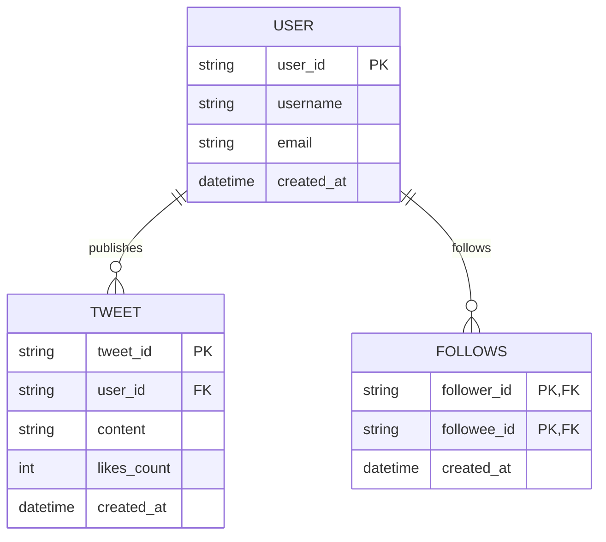
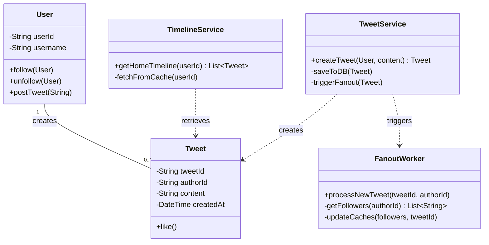

# System Design: Twitter (SDE 1 Level)

This document outlines the system design for a simplified version of Twitter, scoped appropriately for an SDE 1 level discussion. It focuses on the core functionalities of the platform.

---

## 1. Requirements Collection

### Functional Requirements
1. **Post a Tweet:** Users should be able to publish short text messages (tweets).
2. **Timeline:** Users should be able to view a home timeline consisting of tweets from people they follow.
3. **Follow/Unfollow:** Users should be able to follow and unfollow other users.
4. **User Profiles:** Users should be able to register, log in, and view their profile.

### Non-Functional Requirements
1. **High Availability:** The system must be highly available. It's acceptable for a tweet to show up in a timeline with a slight delay (eventual consistency), but the timeline must always load.
2. **Low Latency:** Generating and viewing timelines should be extremely fast (under 200ms).
3. **Scalability:** The system must handle an extremely high read-to-write ratio (many more people read timelines than post tweets) and the "celebrity problem" (users with millions of followers).

---

## 2. Capacity Estimation (Back-of-the-envelope)
*Note: SDE 1s are often expected to do basic math for scale.*
- Let's assume 300 Million Daily Active Users (DAU).
- On average, a user posts 2 tweets a day. Total new tweets = 600 Million/day.
- Read/Write ratio is approximately 100:1 (60 Billion reads/day).
- If an average tweet object (text + metadata) is 1 KB, Daily Storage = `600M * 1KB = 600 GB / day`.
- To serve 60 Billion timeline requests a day, we are looking at ~700k Requests Per Second (RPS) on average, requiring heavy caching.

---

## 3. High-Level System Architecture

The architecture relies heavily on asynchronous processing and caching to serve timelines quickly.

```mermaid
graph TD
    Client[Client Devices: Mobile/Web]
    LB[Load Balancer]
    API[API Gateway]
    
    subgraph Services
        AuthSvc[Authentication Service]
        TweetSvc[Tweet Service]
        TimelineSvc[Timeline Service]
        UserSvc[User / Social Graph Service]
    end

    subgraph Processing Layer (Fanout)
        MessageQueue[Message Queue / Redis Streams]
        FanoutWorkers[Fanout Workers]
    end

    subgraph Storage Layer
        DB[(Primary DB - SQL/NoSQL)]
        SocialGraph[(Social Graph DB - Graph/SQL)]
        RedisCache[(Timeline Cache - Redis)]
    end

    %% Client Interactions
    Client -->|API Requests| LB
    LB --> API
    
    %% Internal Routing
    API --> AuthSvc
    API --> TweetSvc
    API --> TimelineSvc
    API --> UserSvc

    %% Service to DB/Cache
    UserSvc --> SocialGraph
    TimelineSvc --> RedisCache
    
    %% Fanout on Write flow
    TweetSvc -->|1. Store Tweet| DB
    TweetSvc -->|2. Publish Event| MessageQueue
    MessageQueue --> FanoutWorkers
    
    FanoutWorkers -->|3. Fetch Followers| SocialGraph
    FanoutWorkers -->|4. Push Tweet ID| RedisCache
```

### Component Breakdown
1. **API Gateway:** Routes incoming traffic to the appropriate microservices (Auth, Tweet, Timeline, User).
2. **Tweet Service:** Handles receiving new tweets. It persists the tweet to the database and then asynchronously kicks off the fanout process.
3. **User / Social Graph Service:** Manages user data and the follow/unfollow relationships. A graph database or highly optimized SQL schema is used here.
4. **Timeline Service:** Responsible for fetching and returning a user's home timeline. It heavily relies on Redis to retrieve pre-computed timelines in constant time `O(1)`.
5. **Fanout Workers:** When a user tweets, these background workers fetch all the user's followers and push the new tweet's ID into each follower's timeline cache in Redis. This is known as **Fanout-on-Write**.

---

## 4. Entity-Relationship (ER) Diagram

A relational database or distributed NoSQL store can be used. Here is a conceptual schema.



---

## 5. Class Diagram (UML)

This outlines the core backend objects and their interactions.



---

## 6. SDE 1 Focus Areas & Follow-ups

If this were an interview, an SDE 1 should be prepared to discuss:
- **Fanout-on-Write vs. Fanout-on-Read:** 
  - *Fanout-on-Write* works well for normal users, but fails for celebrities (e.g., Elon Musk tweeting to 100M followers would take too long to push to all caches). 
  - *Fanout-on-Read* (pulling the tweet when the user loads their timeline) is better for celebrities. A hybrid approach is often the correct answer.
- **Caching Strategy:** Why use Redis? We use list data structures in Redis where we prepend new tweet IDs. Timelines are limited to, say, the latest 800 tweets to save memory.
- **Eventual Consistency:** Is it okay if a user tweets and a follower doesn't see it for 2 seconds? Yes, this is an acceptable trade-off for high availability and low latency.
- **Pagination:** Timelines need cursor-based pagination (using the `tweet_id` as the cursor since they are usually time-sortable, like Snowflake IDs) rather than offset pagination for better performance.
