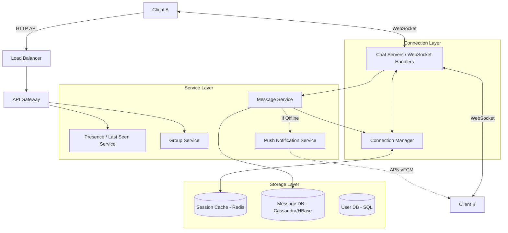
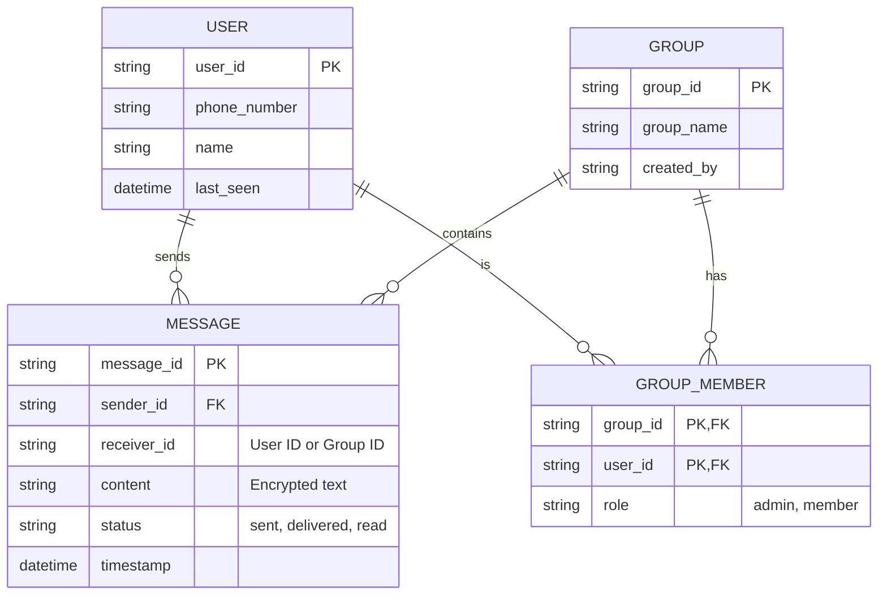
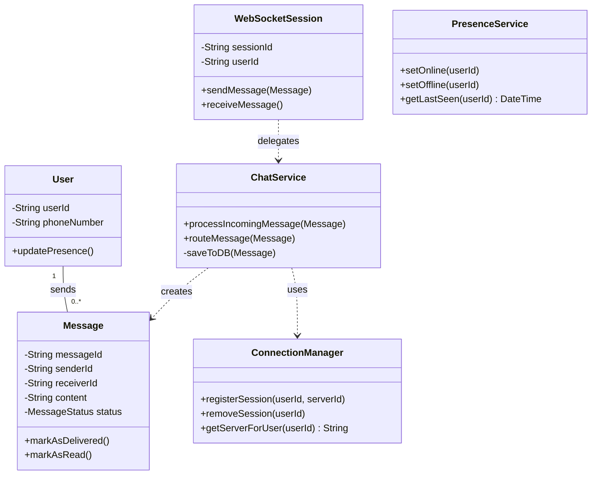

# System Design: WhatsApp (SDE 1/2 Level)

This document outlines the system design for a simplified version of WhatsApp, scoped for an SDE 1 or SDE 2 level discussion. It focuses heavily on real-time messaging, presence, and status updates.

---

## 1. Requirements Collection

### Functional Requirements
1. **1-on-1 Chat:** Users should be able to send real-time text messages to each other.
2. **Group Chat:** Users should be able to send messages to a group of users.
3. **Message Status:** Senders should see delivery statuses (Sent, Delivered, Read).
4. **Presence (Last Seen):** Users should be able to see if other users are online or when they were last seen.

### Non-Functional Requirements
1. **Low Latency:** Messages must be delivered in real-time with minimal delay.
2. **High Availability:** The system must be highly available to accept and route messages.
3. **No Message Loss:** Messages must be delivered even if the receiver is currently offline (store and forward).
4. **End-to-End Encryption (E2EE):** (Brief mention) The server should not be able to read the messages.

---

## 2. Capacity Estimation (Back-of-the-envelope)

- Let's assume **2 Billion** Daily Active Users (DAU).
- On average, a user sends 50 messages a day. Total messages = **100 Billion/day**.
- If an average message is 100 bytes, Daily Storage = `100B * 100 bytes = 10 TB / day`.
- Over 10 years, this would be ~36 PB of storage just for text.
- Peak throughput could be around **5-10 Million messages per second**. This demands a highly scalable connection management system.

---

## 3. High-Level System Architecture

Unlike typical REST-based HTTP applications, a chat application requires persistent connections between the client and the server to push messages instantly. **WebSockets** are the ideal protocol for this.

### Component Breakdown
1. **Chat Servers (WebSocket Handlers):** Maintain millions of open WebSocket connections with clients. They receive incoming messages and push outgoing messages.
2. **Connection Manager & Redis:** Tracks which Chat Server a user is currently connected to. If User A wants to message User B, the Connection Manager looks up User B in Redis to find the exact Chat Server holding their WebSocket connection.
3. **Message Service:** Handles the business logic of storing the message to the database and requesting the Connection Manager to route the message to the recipient.
4. **Push Notification Service:** If User B is offline (no active WebSocket connection), the message is sent via Apple Push Notification service (APNs) or Firebase Cloud Messaging (FCM).
5. **Presence Service:** Manages "Online" and "Last Seen" statuses. Since broadcasting "User X is typing" or "User X is online" to everyone is extremely expensive, this is typically polled or pushed only to active chat windows.

---

## 4. Entity-Relationship (ER) Diagram

A wide-column store like **Cassandra** or **HBase** is typically used for chat messages due to their massive write-heavy nature and sequential read access patterns.

---

## 5. Class Diagram (UML)

This diagram outlines the backend processing logic for a chat session.

---

## 6. SDE 1/2 Focus Areas & Follow-ups

During an interview, you should be prepared to discuss:
- **WebSocket vs. Long Polling:** Why WebSockets are superior for bidirectional real-time communication compared to HTTP Long Polling (less overhead, lower latency).
- **Message Statuses (Ticks):** 
  - *Single Tick (Sent):* Server receives the message and stores it.
  - *Double Tick (Delivered):* Server routes the message to User B, and User B's app sends an ACK (acknowledgment) back to the server, which forwards the ACK to User A.
  - *Blue Ticks (Read):* User B opens the chat, triggering a "read" ACK sent back to User A.
- **Group Chats (Fanout):** If User A sends a message to a group of 100 people, the backend must "fanout" that message to 100 different WebSocket connections.
- **Database Selection:** Why SQL is a bad choice for storing billions of messages daily (B-Tree index becomes too large for memory). Why Cassandra (LSM trees) is ideal for heavy write workloads.
