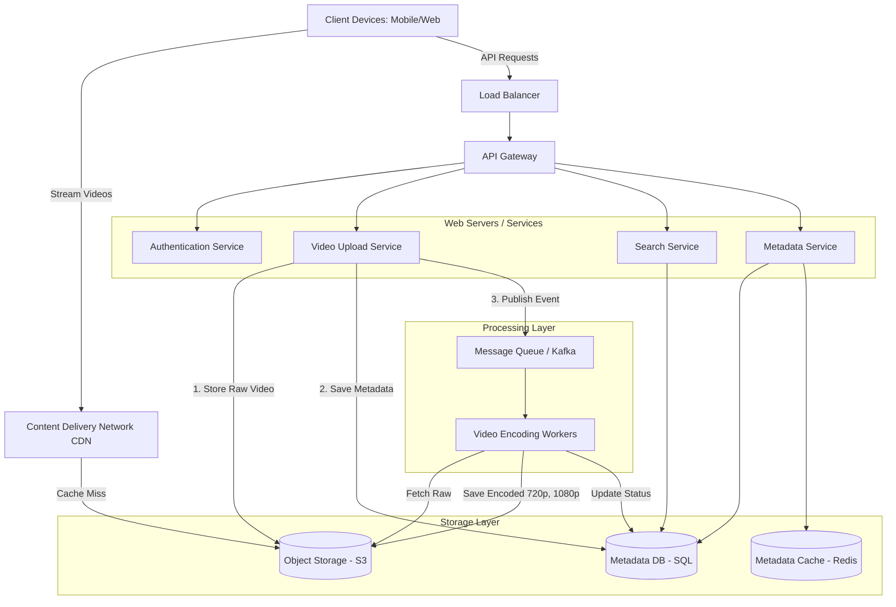
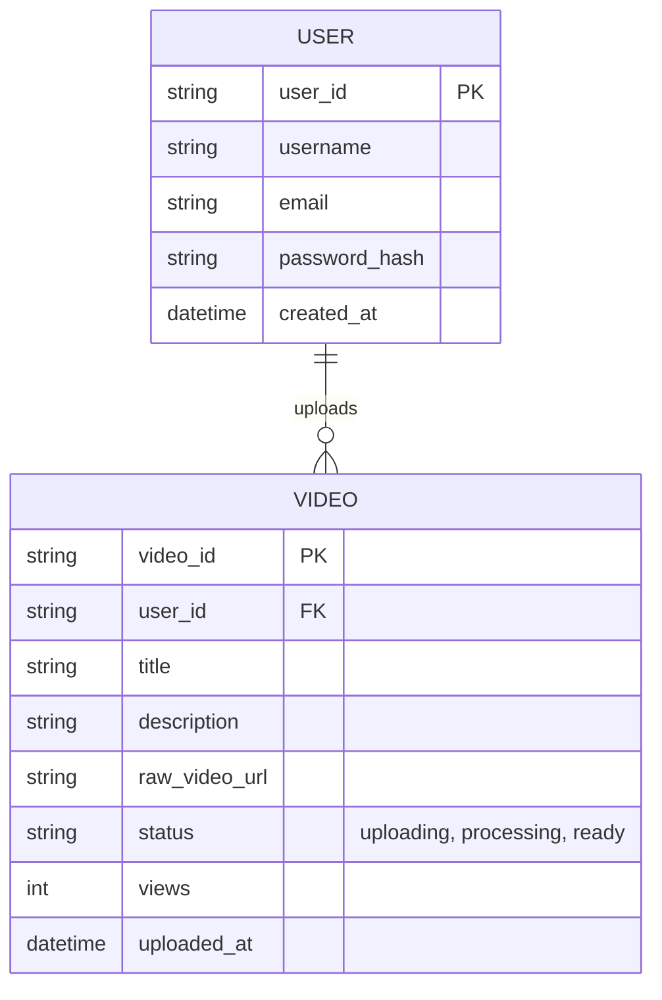
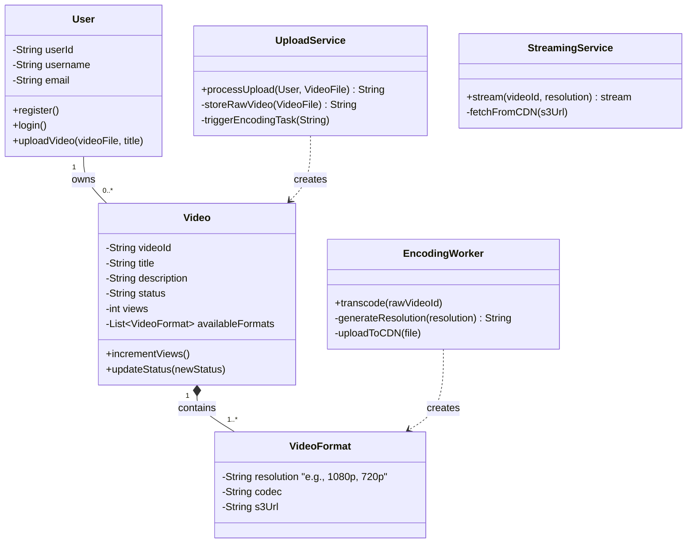

# System Design: YouTube (SDE 1 Level)

This document outlines the system design for a simplified version of YouTube, scoped appropriately for an SDE 1 level discussion. It focuses on the core functionalities of the platform.

---

## 1. Requirements Collection

### Functional Requirements
1. **Upload Video:** Users should be able to upload videos.
2. **Watch Video:** Users should be able to watch videos uploaded by others.
3. **Search:** Users should be able to search for videos by title.
4. **User Profiles:** Users should be able to register and log in to the system.

### Non-Functional Requirements
1. **High Availability:** The system should prioritize availability, especially for watching videos.
2. **Scalability:** The system must handle an extremely high read-to-write ratio (many more people watch videos than upload them).
3. **Low Latency:** Video streaming should start with minimal delay and buffer smoothly.
4. **Reliability:** Uploaded videos should not be lost.

---

## 2. Capacity Estimation (Back-of-the-envelope)
*Note: SDE 1s are often expected to do basic math for scale.*
- Let's assume 100 Million Daily Active Users (DAU).
- On average, a user watches 5 videos a day. Total views = 500 Million/day.
- Read/Write ratio is approximately 100:1.
- Uploads per day = 5 Million videos/day.
- If average video size is 50MB, Daily Storage = `5M * 50MB = 250 TB / day`.
- This indicates we need massive distributed storage (like AWS S3) and a CDN for serving content globally.

---

## 3. High-Level System Architecture

The architecture consists of several microservices to separate the heavy lifting of video processing from the high-throughput video serving.

### Component Breakdown
1. **Client & CDN:** Clients request videos. If a video is popular, it's served directly from the Edge Server via the Content Delivery Network (CDN) for minimum latency.
2. **API Gateway:** Acts as a single entry point, routing requests (upload, search, get metadata) to appropriate microservices.
3. **Upload Service:** Handles the incoming video byte stream, saves it directly to an Object Storage (like AWS S3), and stores the video's metadata (title, uploader) in the database.
4. **Encoding Workers:** Videos must be transcoded into various formats and resolutions (e.g., 480p, 720p, 1080p) to support different network conditions. This is handled asynchronously via a Message Queue.
5. **Metadata Service:** Fetches video information (title, likes, views) to display on the UI. Heavily uses a cache (like Redis) since video metadata is read far more often than written.

---

## 4. Entity-Relationship (ER) Diagram

A relational database (like PostgreSQL or MySQL) is suitable for user and video metadata to maintain ACID compliance. 

---

## 5. Class Diagram (UML)

This object-oriented view represents the main classes that the backend code might use to model the system.

---

## 6. SDE 1 Focus Areas & Follow-ups

If this were an interview, an SDE 1 should be prepared to discuss:
- **API Design:** What does the REST API for `/upload` or `/watch?v={id}` look like?
- **Database Indexing:** Why we should index the `title` field in the `VIDEO` table to make search faster.
- **Error Handling:** What happens if the video encoding fails halfway? (Answer: Retry mechanisms, Dead Letter Queues).
- **Pagination:** When returning search results, we shouldn't return all millions of results at once. How do we implement pagination? (Answer: Offset/Limit or Cursor-based pagination).
